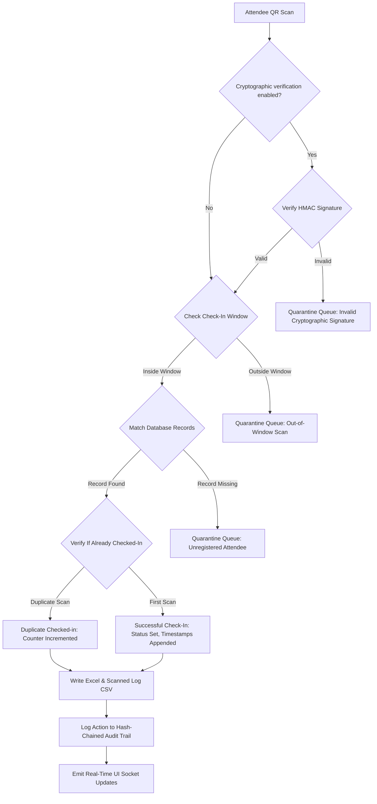

# Functional Guide & Architecture — Upgraded QR Event Check-In System

This document provides a complete functional breakdown, architectural overview, and endpoint reference for the Upgraded QR Event Check-In System.

---

## 1. Project Architecture & Directory Layout

The application is structured as a self-contained Flask and Socket.IO system utilizing an Excel spreadsheet (`registrations.xlsx`) as the master database. Administrative activities, security configurations, logs, and generated assets are organized per event.

```text
qr_checkin_system/
├── app.py                      # Flask + Socket.IO server, core check-in engine & admin dashboard APIs
├── qradding.py                 # CLI/utility tool for batch unique ID, QR, and barcode generation
├── qrsendemail.py              # CLI/utility tool for batch email campaigns using SMTP
├── search_sockets.py           # Diagnostic script checking port availability and code port values
├── requirements.txt            # Python dependencies (Flask, SocketIO, openpyxl, pandas, pillow, python-barcode, qrcode, eventlet)
├── run_system.bat              # Windows batch script launcher
├── templates/
│   ├── dashboard.html          # Manager dashboard UI (premium dark-mode grid with real-time updates)
│   ├── index.html              # Mobile-responsive camera scan portal (Webcam check-in client)
│   └── login.html              # Security passcode lock gate screen
├── static/                     # CSS, JS, audio assets, and logo assets
└── events/
    └── [Event Name]/           # Event-scoped directory (e.g. "Default Event")
        ├── registrations.xlsx  # Master database of guests and metadata columns
        ├── config.json         # Security controls, check-in windows, templates, and SMTP credentials
        ├── scanned_log.csv     # Check-in log entries (raw audit CSV)
        ├── audit_log.csv       # Tamper-evident admin action ledger (cryptographic hash chained)
        ├── quarantine.json     # Quarantine queue storage for failed check-in attempts
        ├── qrcodes/            # Generated QR PNG images
        └── barcodes/           # Generated Barcode PNG images
```

---

## 2. app.py — Core Engine Functions

### 2.1 Request & Utility Helpers

#### `_parse_ua(ua: str) -> str`
- **Purpose**: Parses client User-Agent strings to identify the operating system and browser.
- **Arguments**: `ua` (User-Agent string).
- **Returns**: A simplified identifier (e.g., `"Windows Chrome"`, `"iPhone Safari"`).

#### `get_lan_ip() -> str`
- **Purpose**: Dynamically detects the host's IPv4 address on the local network (LAN) for multi-device sharing.
- **Returns**: LAN IP string (e.g. `"192.168.1.15"`) or `"127.0.0.1"`.

#### `is_localhost_request() -> bool`
- **Purpose**: Injects localhost guards to differentiate direct server requests from remote requests.
- **Returns**: `True` if remote IP is `127.0.0.1` or `::1` and no routing headers (`X-Forwarded-For`) are present.

#### `is_dashboard_authorized() -> bool`
- **Purpose**: Checks dashboard authorization status. Respects the configuration toggle `enforce_localhost_auth`. If enabled, localhost accesses are forced to submit the passcode, locking down terminal access.
- **Returns**: `True` if authorized, `False` otherwise.

#### `_is_rate_limited(ip: str, device_id: str) -> bool`
- **Purpose**: Prevents rate-limit bypasses and double-checkin scans by rate-limiting request sessions on a composite key: `f"{ip}:{device_id}"` with a 1.5-second window.
- **Returns**: `True` if restricted, `False` if allowed.

#### `_normalize_phone(phone, allowed_ccs: str = None) -> str`
- **Purpose**: Cleans and normalizes phone numbers to standard E.164 formats (e.g. `+919876543210`).
  - Filters out impossible strings (e.g. all zeros, length < 7, length > 15 digits).
  - Uses prioritized default list from configuration (e.g., `"91,1,44"`) to parse and auto-prepend country codes.
- **Returns**: Normalised phone string or `""` if invalid.

#### `_validate_attendee_integrity(row_dict: dict, existing_regs: set) -> list[str]`
- **Purpose**: Hardens data entry by enforcing format rules on attendee fields before database inserts:
  - **Name**: Must be non-empty and not numeric.
  - **Registration Number**: Must be non-empty and unique (not in `existing_regs`).
  - **Email**: Must contain `@`.
  - **Phone**: Must pass `_normalize_phone` validation.
- **Returns**: A list of error message strings (empty list indicates successful validation).

---

### 2.2 Path Resolvers & Transaction Controls

#### `get_active_event_path()`, `get_excel_file()`, `get_highlighted_file()`, `get_log_file()`, `get_qr_dir()`, `get_barcode_dir()`, `get_config_file()`
- **Purpose**: Relative path resolvers pointing dynamically to the selected event's directory assets under `events/[Active Event]/`.

#### `get_event_config() -> dict`
- **Purpose**: Loads configuration parameter rules from the event's `config.json` file.
- **Returns**: Dictionary with configuration keys, merging default fallbacks.

#### `save_event_config(cfg: dict) -> None`
- **Purpose**: Thread-safe serialisation of the dictionary back to `config.json`.

#### `_atomic_save(wb, target_path: str) -> None`
- **Purpose**: Thread-safe database commit utilizing version rotation on Excel files.
  - Rotates up to 3 backup versions (`registrations.xlsx.bak1`, `.bak2`, `.bak3`) before replacing the file to prevent file loss/corruption on Windows server platforms.

---

### 2.3 Security and Cryptographic Controls

#### `_generate_cryptographic_signature(payload: str) -> str`
- **Purpose**: Generates a secure, event-scoped cryptographic QR code signature.
- **Algorithm**: SHA256 HMAC signature using the event's secret key from `config.json`.
- **Returns**: Hexadecimal HMAC signature string.

#### `_verify_cryptographic_signature(payload: str, signature: str) -> bool`
- **Purpose**: Validates the authenticity of event-scoped signed QR code scans.
- **Returns**: `True` if signature matches, `False` otherwise.

#### `_log_audit(action: str, details: str, device_id: str = "System") -> None`
- **Purpose**: Appends administrative check-ins, overrides, configurations, and check-in revocations to a tamper-evident, hash-chained `audit_log.csv`.
- **Chaining Mechanism**: Calculates a SHA256 hash of the row content appended to the *previous row's hash*:
  $$\text{Hash}_i = \text{SHA256}(\text{Hash}_{i-1} \parallel \text{Timestamp} \parallel \text{Action} \parallel \text{Details} \parallel \text{IP} \parallel \text{DeviceID} \parallel \text{UserAgent})$$
  This makes unauthorized deletion or alteration of audit records instantly discoverable.

#### `_verify_audit_log_integrity(file_path: str) -> tuple[bool, int]`
- **Purpose**: Iterates through the audit CSV to recalculate and verify the hash chain sequence.
- **Returns**: `(True, 0)` if valid, or `(False, line_number)` indicating where tampering occurred.

#### `_quarantine_scan(qr_data: str, device_name: str, reason: str) -> None`
- **Purpose**: Logs check-in failures due to expired windows, invalid cryptographic signatures, or unregistered QR payloads to `quarantine.json`.
- **Actions**: Appends scan record, increments bad attempt counters, and emits a `quarantine_updated` Socket.IO alert.

---

### 2.4 core Core Check-In Logic

#### `_perform_checkin(qr_data: str, device_id: str) -> tuple[dict, int]`
- **Purpose**: The main check-in validation and processing engine.
  1. Checks rate limiting.
  2. Checks date-time windows.
  3. Performs cryptographic signature verification if enabled.
  4. Performs exact QR database matching.
  5. If validation fails, calls `_quarantine_scan` and returns structured error codes.
  6. If validation succeeds, increments the scan counter, logs timestamps, writes to Excel atomically, updates the scanned log CSV, and logs the check-in to the audit log.
- **Returns**: Tuple `(response_json, status_code)`.

---

### 2.5 Flask API Routes

| Endpoint | Method | Security | Description |
|---|---|---|---|
| `/` | GET | None | Renders the mobile-responsive webcam check-in scan client. |
| `/dashboard` | GET | Passcode / Localhost | Renders the manager dashboard interface. |
| `/login` | GET/POST | None | Authenticates dashboard admin sessions. |
| `/stats` | GET | Passcode / Localhost | Aggregates check-in numbers (Total, Unique, Duplicates). |
| `/registry` | GET | Passcode / Localhost | JSON endpoint rendering the full attendee roster. |
| `/scan` | POST | None | Ingests camera scans, runs validation, checks in, or quarantines. |
| `/manual_checkin` | POST | Passcode / Localhost | Manually checks in attendees from the dashboard. |
| `/revoke_checkin` | POST | Passcode / Localhost | Revokes/undos check-in, decrementing counts and logging the undo. |
| `/quarantine` | GET | Passcode / Localhost | Returns JSON quarantine queue scans. |
| `/quarantine/approve` | POST | Passcode / Localhost | Approves quarantined items, checking them in or registering them as guests. |
| `/quarantine/reject` | POST | Passcode / Localhost | Discards and deletes quarantined items. |
| `/export_audit_log` | GET | Passcode / Localhost | Runs integrity checks on `audit_log.csv` and streams the file. |
| `/stats/timeline` | GET | Passcode / Localhost | Returns hourly check-in arrival bucket metrics. |
| `/bulk_notify` | POST | Passcode / Localhost | Queues invitations for all members of a subgroup. |
| `/health` | GET | Passcode / Localhost | Diagnostics (Excel lock check, QR directory check, tunnel statuses). |

---

## 3. CLI Helper Scripts

### 3.1 qradding.py
- **Purpose**: Bulk generator utility.
- **Functionality**:
  - `generate_unique_ids(df, id_col)`: Ensures empty unique ID slots are populated with random 8-character codes.
  - `main()`: Loads target spreadsheets, generates QR codes and barcodes in parallel threads, embeds images inside specific cell columns using openpyxl, and saves atomically.

### 3.2 qrsendemail.py
- **Purpose**: Bulk email dispatcher utility.
- **Functionality**:
  - `send_all()`: Loops through roster records, compiles email templates, attaches QR badges, connects to SMTP servers via SSL/TLS, and updates email delivery states in the database.

### 3.3 search_sockets.py
- **Purpose**: Network utility diagnosing socket occupancy to prevent port binding conflicts.

---

## 4. Frontend Client Features (`templates/dashboard.html`)

The dashboard incorporates dynamic HTML components, CSS styling, and Socket.IO listeners:
1. **Real-time Live Sync**: Listeners to `row_updated` and `registry_updated` instantly sync datatable statuses in-place, without page reloads.
2. **Security Controls Settings Panel**: Form inputs mapping configuration flags `enforce_localhost_auth`, `cryptographic_qr_verification`, and `allowed_country_codes` directly to the `/save_config` API.
3. **Revoke Buttons**: A revoke button rendered on checked-in registry rows that prompts confirmation and posts to `/revoke_checkin`.
4. **Quarantine Manager Tab**: Interactive log displaying quarantined scans with button actions triggering approvals or rejections.
5. **Peak Arrivals Timeline**: Visual SVG/CSS vertical bar chart showing check-in activity by hour, automatically updated when check-ins occur.
6. **Subgroup Broadcaster**: Subgroup pills displaying attendee counts, rename options, and a broadcast button `📢` to bulk notify groups via Email, WhatsApp, SMS, or All.

---

## 5. Security & Upgrades Verification Flow


