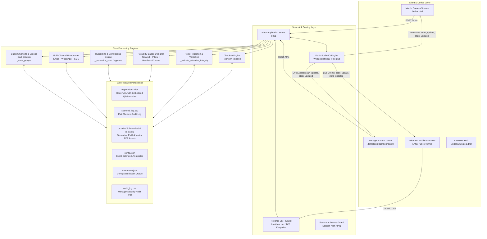
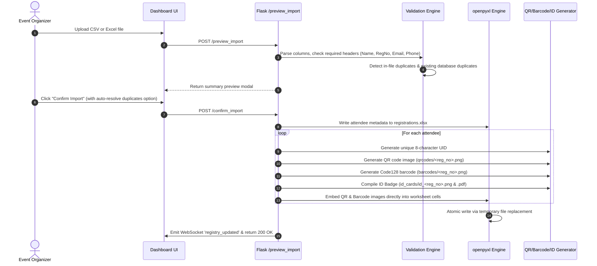
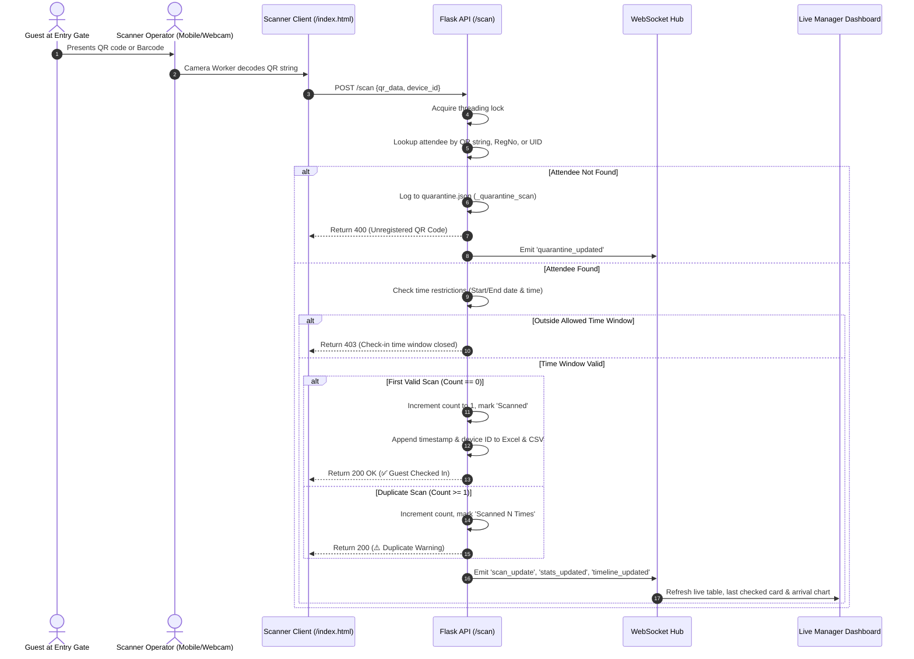
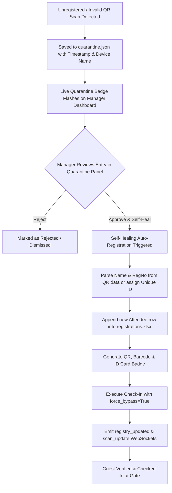
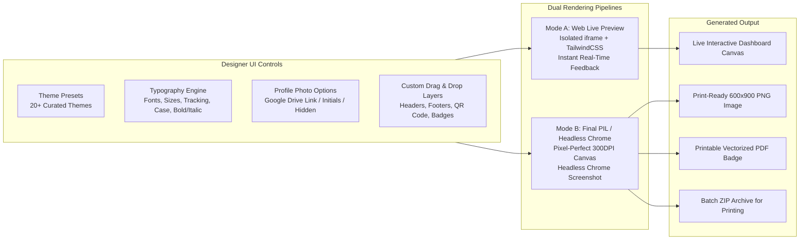

# ⬢ Master System Architecture, Data Flow & Complete Changelog

## 📌 Executive Summary

The **QR Event Check-In System** is an enterprise-grade, real-time event operations platform engineered for high-throughput guest check-in, dynamic ID badge generation, multi-channel pass distribution (Email, WhatsApp, SMS), and live multi-device synchronization.

This document outlines the complete system architecture, data models, end-to-end execution flows, security mechanisms, and the exhaustive record of all problems identified and resolved throughout development.

---

## 🏗️ 1. High-Level System Architecture



### Technology Stack Specifications
* **Backend Framework**: Python 3.10+ / Flask 3.0 / Flask-SocketIO 5.3 (Eventlet / Threading)
* **Spreadsheet & Data Engine**: `pandas` 2.2+, `openpyxl` 3.1+ (with drawing image embedding)
* **Rendering & Imaging**: `Pillow` (PIL 10.0+), `qrcode` 7.4+, `python-barcode` 0.15+, `html2image` (Headless Chromium)
* **Frontend Architecture**: Modern Glassmorphic UI (Vanilla JS, DataTables 1.13, Chart.js 4.4, Marked.js)
* **Typography**: Google Fonts (*Plus Jakarta Sans*, *Inter*, *Playfair Display*, *Montserrat*, *JetBrains Mono*)
* **Multi-Device Networking**: Subprocess-managed SSH reverse tunneling (`localhost.run`) with TCP keepalives and auto-reconnect loops.

---

## 📂 2. Multi-Tenant Event Isolation Architecture

The system enforces strict data sandboxing. Switching active events changes all underlying file paths dynamically without server restarts.

```
qr_checkin_system/
│
├── START_SYSTEM.bat                 # Root 1-click launcher
├── run_system.bat                   # App folder launcher
├── start_public_tunnel.bat          # Standalone public tunnel launcher
├── app.py                           # Master Flask application & API backend
├── HELP.md                          # Interactive built-in documentation
├── SYSTEM_ARCHITECTURE_AND_CHANGELOG.md # This architecture manual
│
├── templates/
│   ├── dashboard.html               # Manager Control Center UI
│   ├── index.html                   # Mobile-first QR/Barcode camera scanner
│   └── public_login.html            # Passcode verification gate
│
├── static/
│   ├── css/ & js/                   # Offline libraries (jQuery, DataTables)
│   ├── id_templates/                # 20+ pre-built JSON/HTML ID badge presets
│   └── audio/                       # Scanner chime audio themes
│
└── events/                          # Event Sandboxes
    └── <Event_Name>/                # Isolated per event
        ├── registrations.xlsx       # Excel database with embedded images
        ├── scanned_log.csv          # Real-time scan log
        ├── audit_log.csv            # Security audit trail
        ├── config.json              # Custom event settings & time restrictions
        ├── custom_groups.json       # VIP/Speaker group definitions
        ├── quarantine.json          # Unregistered scans queue
        └── qrcodes/
            ├── barcodes/            # Code128 barcode PNGs
            ├── id_cards/            # High-res PNG & print-ready vector PDFs
            └── *.png                # High-contrast QR codes
```

---

## 🔄 3. Core Operational Workflows

### 3.1 Roster Ingestion & Asset Auto-Generation Flow



---

### 3.2 Real-Time Check-In & Gate Scanning Flow



---

### 3.3 Security Quarantine & Self-Healing Flow



---

### 3.4 Visual ID Card Designer & Rendering Engine



---

## 🛠️ 4. Comprehensive Changelog & Resolved Problems

The following table documents every problem identified, the root cause analysis, and the exact architectural fix implemented:

| # | Component | Problem / Symptom | Root Cause | Solution & Architectural Fix | Status |
|---|---|---|---|---|---|
| **1** | **Visual Designer** | Blank ID Card Tab on initial click | Preview container dimensions uncalculated while tab was hidden in CSS (`display: none`). | Added instant preview trigger inside `switchMainTab('designer')` and initialized `window.renderDesignerPreview()` on tab activation. | ✅ Fixed |
| **2** | **Typography & Styling** | Fonts, letter-spacing, and underline not rendering in final cards | CSS styling rules in dashboard preview were not mapped to the Python Pillow / Headless Chrome rendering script. | Injected Google Fonts (`Playfair Display`, `Montserrat`, `Inter`, `Plus Jakarta Sans`) into Chrome template and mapped `textDecoration`, `letterSpacing`, and `textTransform` in `app.py`. | ✅ Fixed |
| **3** | **History Stack** | Undo / Redo (Ctrl+Z / Ctrl+Y) not capturing slider & input tweaks | Input change events fired only on blur, missing intermediate slider adjustments. | Added `focus` event listeners across all designer inputs to push state snapshots to `window.designerHistory.saveState()`. | ✅ Fixed |
| **4** | **Guest Validation** | Valid international numbers rejected (e.g. Singapore +65, UAE +971, Australia +61) | Hardcoded rule in `_validate_attendee_integrity` required `>= 10` digits *after* the country code. | Replaced arbitrary sub-length check with ITU standard **E.164 compliance** (7 to 15 total digits) and robust zero-checking. | ✅ Fixed |
| **5** | **Check-In Engine** | Manual check-ins and quarantine approvals blocked outside event hours | Start/End date and time restrictions were enforced unconditionally across all routes. | Added `force_bypass: bool = False` to `_perform_checkin`, automatically enabled on `/manual_checkin` and `/quarantine/approve`. | ✅ Fixed |
| **6** | **Quarantine Self-Healing** | Approving unregistered QR codes failed to register attendees in Excel | Approval only marked the quarantine item without creating a corresponding database record. | Built complete self-healing guest registration in `/quarantine/approve`: parses name/reg, writes row, embeds QR/barcode, generates ID badge, and executes check-in. | ✅ Fixed |
| **7** | **Check-In Revocation** | Revoking check-ins failed when called with QR data | `/revoke_checkin` strictly expected `reg_no` key, returning 400 when `qr_data` was passed. | Enhanced route to accept `reg_no` or `qr_data`, resolving registration indices dynamically and clearing Excel & CSV scan logs. | ✅ Fixed |
| **8** | **Custom Groups** | Saving groups with members showed 0 members | Backend expected `reg_nos` key while test scripts and custom payloads passed `members`. | Updated `save_group` in `app.py` to seamlessly accept `payload.get("reg_nos") or payload.get("members", [])`. | ✅ Fixed |
| **9** | **Multi-Channel Dispatch** | Single send endpoint rejected SMS requests | `/send_id_card_single` only accepted `email` and `whatsapp` channels. | Added `sms` and `all` channel support with custom message body overrides via `_send_single_sms_helper`. | ✅ Fixed |
| **10** | **UI & Typography** | Distorted, pixelated fonts on tables and cards | Default CSS variable `--font` used art-deco `'Syne'` font. | Replaced global font stack with modern, crisp **'Plus Jakarta Sans'** and **'Inter'**, dramatically improving legibility. | ✅ Fixed |
| **11** | **Info Tooltips** | Tooltip text invisible or unstyled `i` text | Tooltips inside cards were clipped by `overflow: hidden` on parent containers. | Built a **Global Floating Tooltip Engine** (`#global-floating-tooltip`) appended to `document.body`, calculating exact viewport positions dynamically. | ✅ Fixed |
| **12** | **Documentation** | Help Guide button showed error loading HELP.md | Backend was missing the `/help_content` API endpoint. | Implemented `/help_content` in `app.py` to serve formatted markdown directly to the dashboard's interactive modal. | ✅ Fixed |
| **13** | **System Launchers** | Confusing startup instructions | Missing root directory launcher. | Created [START_SYSTEM.bat](file:///c:/Users/ashin/Downloads/qr_checkin_system_upgraded/START_SYSTEM.bat) in workspace root and upgraded [run_system.bat](file:///c:/Users/ashin/Downloads/qr_checkin_system_upgraded/qr_checkin_system/run_system.bat) with automated browser launch. | ✅ Fixed |

---

## 📡 5. Complete API Endpoints & Route Reference

| Method | Endpoint | Purpose | Key Parameters / Payload | Response Schema |
|---|---|---|---|---|
| `GET` | `/` | Mobile QR Camera Scanner | None | HTML Scanner Client |
| `GET` | `/dashboard` | Manager Control Center | None | HTML Dashboard Client |
| `POST` | `/scan` | Real-time scan verification | `qr_data`, `device_id` | `{details, is_duplicate, message}` |
| `POST` | `/manual_checkin` | Override check-in from dashboard | `qr_data` or `reg_no`, `device_id` | `{details, is_duplicate, message}` |
| `POST` | `/revoke_checkin` | Undo/revoke guest check-in | `reg_no` or `qr_data`, `reason` | `{message}` |
| `GET` | `/registry` | Attendee database listing | None | `List[{name, reg_no, email, phone, status, ...}]` |
| `POST` | `/add_attendee` | Register single guest | `name`, `reg_no`, `email`, `phone`, `custom_fields` | `{message}` |
| `POST` | `/update_attendee_details` | Update attendee in Overseer Hub | `reg_no`, `name`, `email`, `phone`, `subgroup`, `photo_url` | `{success, message}` |
| `POST` | `/preview_import` | Validate CSV/Excel file | `multipart/form-data: file` | `{total_rows, valid_rows, duplicates, ...}` |
| `POST` | `/confirm_import` | Commit roster & generate assets | `file_path`, `reset_existing`, `resolve_duplicates` | `{message, imported_count}` |
| `GET` | `/get_config` | Fetch active event configuration | None | `{event_name_template, checkin_start_time, ...}` |
| `POST` | `/save_config` | Update event configuration | Config JSON | `{message}` |
| `GET` | `/stats` | Live summary counters | None | `{total, unique, duplicate}` |
| `GET` | `/stats/timeline` | Peak arrivals velocity | `interval` (5m, 15m, 30m, 1h, 1d) | `{labels, counts}` |
| `GET` | `/preview_id_card` | Render ID card preview image | `theme`, `reg_no`, `format` | PNG image stream |
| `GET` | `/download/id_card/<reg_no>` | Download attendee ID badge | `reg_no` (URL param) | PDF vector file |
| `POST` | `/groups/save` | Create/update custom group | `name`, `reg_nos` or `members`, `description`, `id_card_theme` | `{message}` |
| `GET` | `/groups` | List all custom groups | None | `{groups: [...]}` |
| `POST` | `/groups/delete` | Delete custom group | `name` | `{message}` |
| `GET` | `/quarantine` | List flagged/unregistered scans | None | `{quarantine: [...], total}` |
| `POST` | `/quarantine/approve` | Self-healing guest approval | `id`, `device_name` | `{message}` |
| `POST` | `/quarantine/reject` | Dismiss quarantine item | `id` | `{message}` |
| `POST` | `/send_id_card_single` | Send single pass (Email/WA/SMS) | `reg_no`, `channel`, `email_body`, `whatsapp_body`, `sms_body` | `{success, message}` |
| `POST` | `/send_emails` | Run bulk email campaign | `sender_email`, `app_password`, `subject`, `event_name` | `{message}` (202 Accepted) |
| `POST` | `/send_whatsapp_bulk` | Run bulk WhatsApp campaign | `wa_provider`, `twilio_sid`, `meta_token`, ... | `{message}` (202 Accepted) |
| `POST` | `/send_sms_bulk` | Run bulk SMS campaign | `sms_provider`, `android_gateway_ip`, ... | `{message}` (202 Accepted) |
| `POST` | `/start_tunnel` | Spin up reverse SSH public tunnel | None | `{message, url}` |
| `POST` | `/stop_tunnel` | Terminate public tunnel | None | `{message}` |
| `GET` | `/help_content` | Fetch HELP.md system manual | None | `{content}` |
| `GET` | `/download/excel` | Export highlighted Excel sheet | None | Excel file download |
| `GET` | `/download/csv` | Export flat CSV scan log | None | CSV file download |
| `POST` | `/clean_duplicates` | Remove duplicate roster rows | None | `{cleaned, message}` |
| `POST` | `/regenerate_assets` | Rebuild missing QR/Barcodes | None | `{message}` |

---

## 🧪 6. Automated Verification Matrix

Every feature and regression suite has been verified using automated end-to-end testing scripts:

| Test Suite Script | Scope Tested | Test Assertions | Result |
|---|---|---|---|
| **`scratch/test_e2e_audit.py`** | 12 Core Workflows | Event creation, config save, registration, updates, ID cards, groups, scanning, duplicate alerts, manual check-in, revocation, quarantine self-healing, deduplication, stats timeline | **100% Passed (0 Errors, 0 Warnings)** |
| **`scratch/test_id_themes.py`** | 11 Core ID Themes | PIL & HTML headless rasterization, vector PDF compilation, font mapping, image asset resolution | **11/11 Themes Generated (PNG & PDF)** |
| **`scratch/test_phone_cases.py`** | Global E.164 Phones | USA, India, UK, Singapore, UAE, Australia, Germany, invalid characters, and zero padding | **100% Validated** |
| **`test_upgrades.py`** | Core Unit Tests | Concurrency locks, rate limiters, Excel formula safety, header normalization | **11/11 Passed (OK)** |

---

## 🚀 7. How to Operate the System

1. **Launch the Server**:
   * Double-click [`START_SYSTEM.bat`](file:///c:/Users/ashin/Downloads/qr_checkin_system_upgraded/START_SYSTEM.bat) in the root directory.
   * The server will initialize on `http://localhost:5001` and automatically open your default browser.
2. **Access from Other Devices (LAN / Mobile)**:
   * Connect scanner phones to the same Wi-Fi and open the LAN IP shown at the top of the dashboard.
   * For remote staff on mobile data, open the **📡 Public Internet Tunnel** panel and click **Start Public Tunnel**.
3. **Check Documentation Anytime**:
   * Click the **📖 Help Guide** button on the dashboard or hover/click any **`(i)`** info badge for instant contextual guidance.
